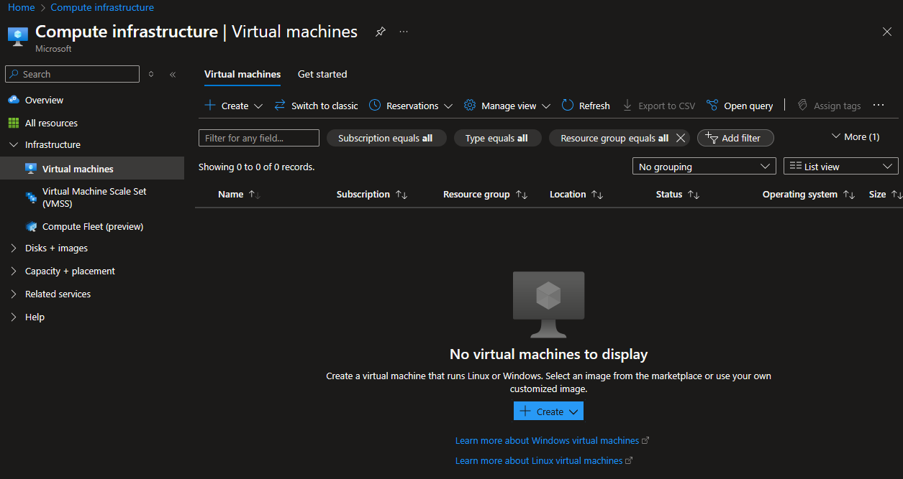
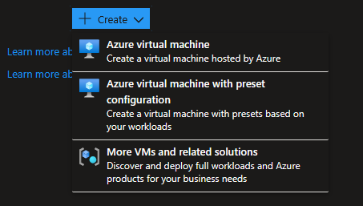
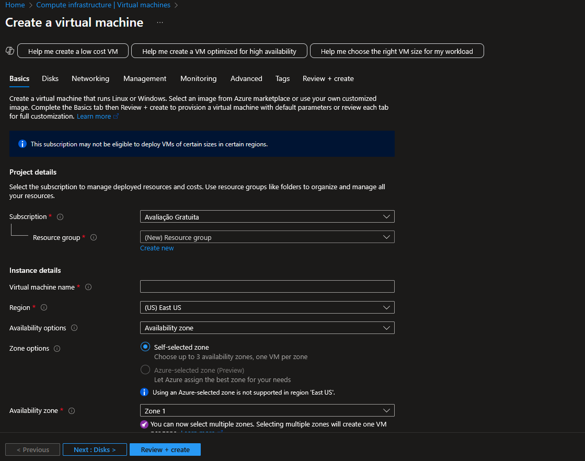
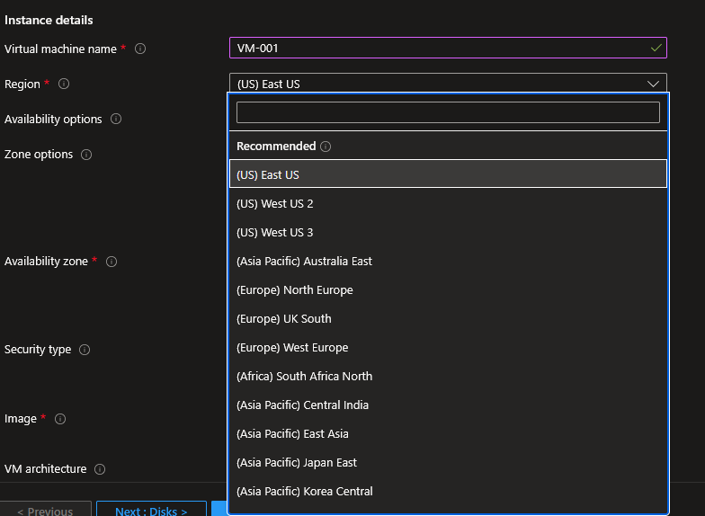
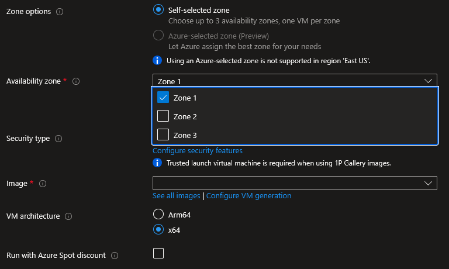
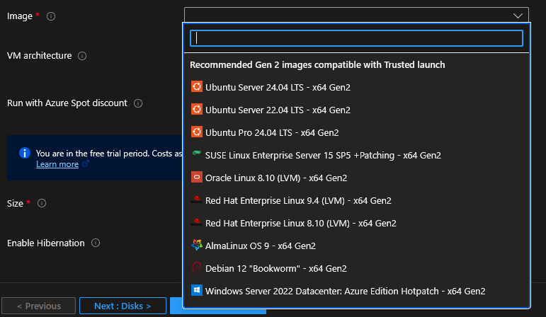
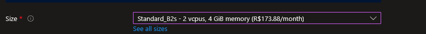

# 🖥️ Máquinas Virtuais (VMs)

Este documento apresenta os principais tipos de máquinas virtuais da Azure e um pequeno tutorial de como criar uma.

## 📊 Índice

- [Introdução](#-introdução)
- [Máquinas Virtuais no Portal Azure](#-maquinas-virtuais-no-portal-azure)

## 🔷 Introdução

É possivel criar e gerenciar máquinas virtuais de várias formas:

- UI do Portal Azure
- Cloud Shell
- SSH
- Terraform

## 🔷 Maquinas Virtuais no Portal Azure

Oo Portal Azure, na seção de máquinas virtuais, permite criar, visualizar e gerenciar VMs através de UI.

## 🔷 Criando uma máquina virtual com o Portal

Existem 3 opções principais para criar uma máquina virtual:

- Criar uma máquina do zero, personalizando cada etapa
- Criar uma máquina com uma configuração salva previamente (útil para replicar máquinas VMs)
- Criar uma máquina com uma configuração mais complexa, como em uma cloud Híbrida.

Neste documento seguiremos com a primeira opção.

A tela de criação da VM apresenta uma listade abas para a configuração, tais como Basics, Disks e Networking.
Neste momento não detalharemos muito essas configurações.
A partir da aba Basics é possivel criar uma VM operacional.

Nos campos de Subscrição é possivel definir um perfil de custo onde a VM será criada. Utilizando a Avaliação Gratuita, não é necessário alterar nada aqui.

Nos campos de Detalhes da Instância são definidos o nome da instância e configurações de região e zona para o deploy.

Regiões disponíveis (nem todas no tier gratuíto)

E a lista de regiões disponiveis. Definindo mais de uma, você aumenta a disponibilidade.

Escolha a imagem a ser aplicada no disco da sua VM.

Defina a máquina que usará o disco. A lista é grande e apresenta sugestões com base no uso.

Defina o usuário administrador da máquina (será necessário para acessá-la depois).
Pode ser definido um usuário/senha ou um par de chaves SSH para acesso remoto.

Defina que posrtas estão acessíveis (22 é obrigatória se for acessar por SSH)

Review and create!

## 🔷 Criando uma máquina virtual com linha de comando

Em contrução

## 🔷 Criando uma máquina virtual com Terraform

Em contrução
